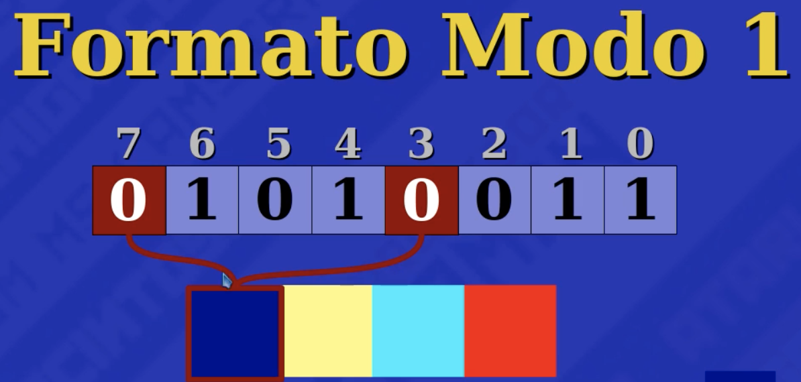
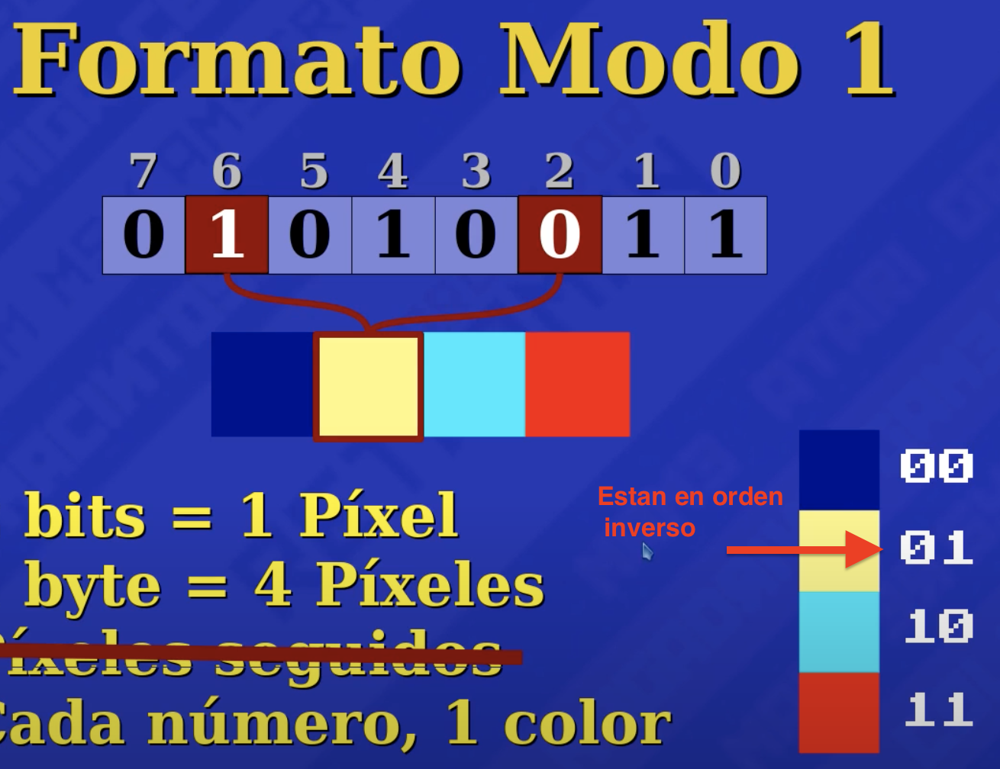
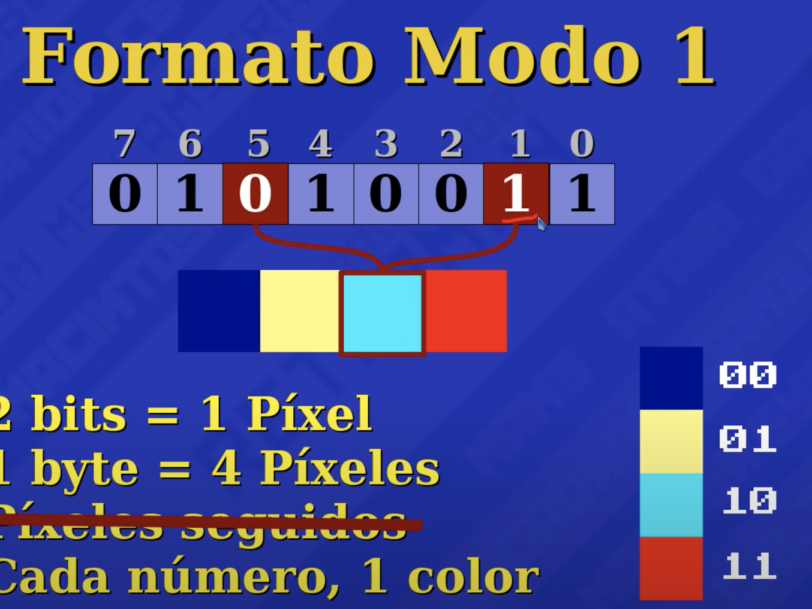
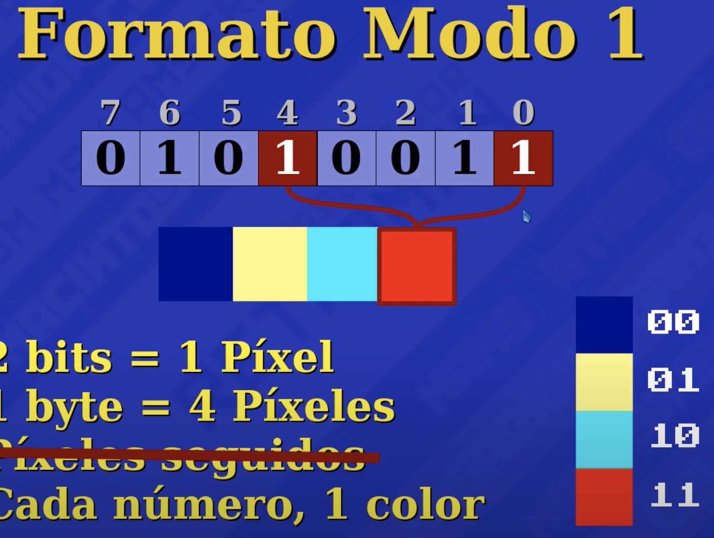
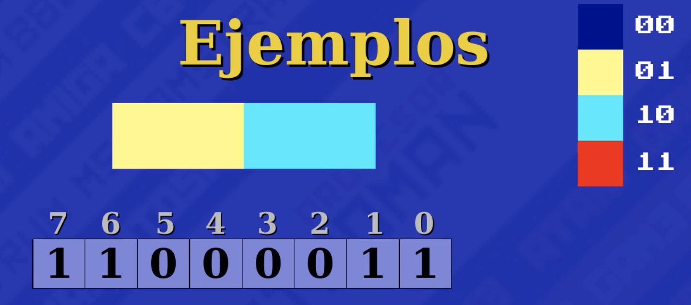
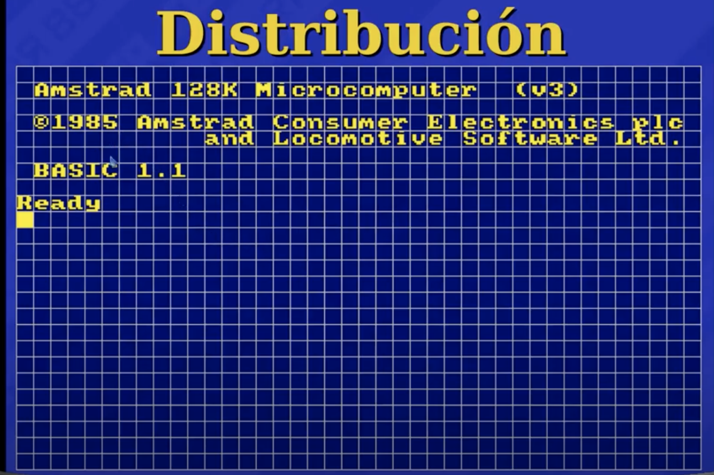
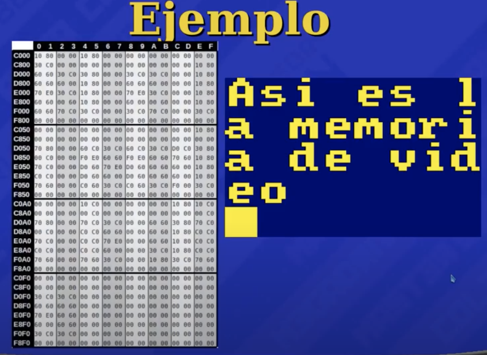
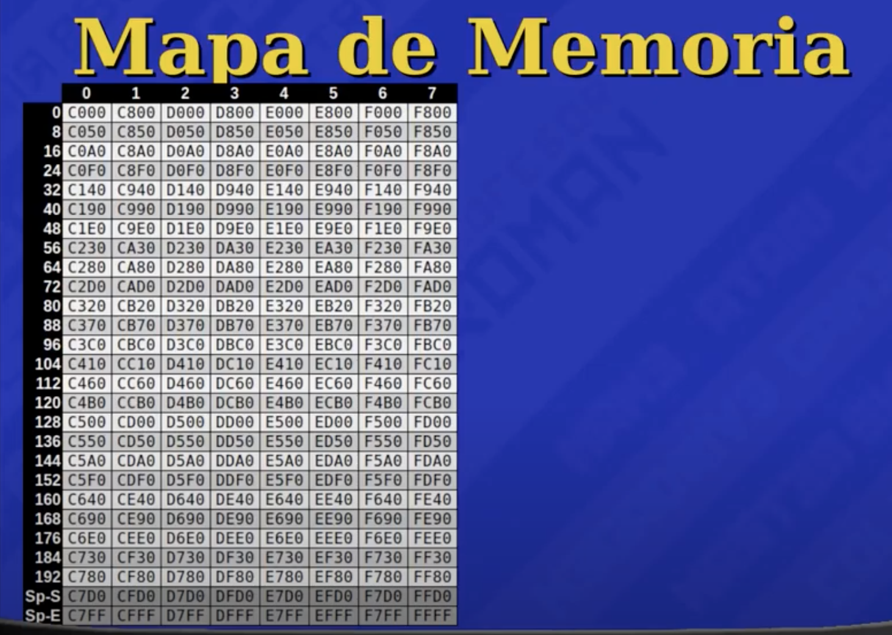

### Memoria de Video
inicio:C000    
fin: FFFF    
     
### Formato MODO 1 de video
```
4 colores, 2 bits por pixel.   
00 Azul
01 Amarillo
10 Cyan
11 Rojo
```
los bits no van consecutivos
 
 
 
 
 
### Distribucion de la Memoria de Video
Ancho 320 pixeles.   
Alto 200 pixeles.  
equivalente a 40x25 caracteres de 8x8 pixeles.   

 
    
Distribucion de pixeles: 8 lineas por caracter      
* primera linea de toda la pantalla: C000 - C7FF
* segunda linea de toda la pantalla: C800 - CFFF
* tercera linea de toda la pantalla: D000 - D7FF
* cuarta linea de toda la pantalla:  D800 - DFFF
* quinta linea de toda la pantalla:  E000 - E7FF
* sexta linea de toda la pantalla:   E800 - EFFF
* septima linea de toda la pantalla: F000 - F7FF
* octava linea de toda la pantalla:  F800 - FFFF

 
### Inicio de Memoria de cada fila de Pixeles
ejemplo: la direccion donde empieza la fila 83 seria: DB20     
 


